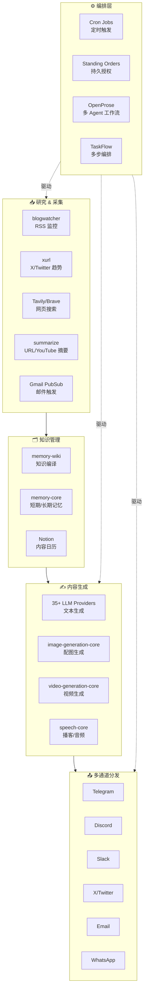

# OpenClaw 内容创作能力评估 & 自动化工作流可行性分析

## 一、总体评价

OpenClaw 本身不是一个"内容创作工具"，而是一个**多模型 AI agent 运行时 + 多通道通信网关**。但它提供的 skills、extensions、自动化原语（cron、hooks、standing orders、TaskFlow、OpenProse）和多通道分发能力，使其具备搭建**端到端内容创作自动化工作流**的完整基础设施。

> [!IMPORTANT]
> 关键结论：OpenClaw 已经具备内容创作自动化工作流所需的全部拼图碎片，但目前还没有一个现成的、开箱即用的"内容创作工作流模板"。需要用户自行编排。

---

## 二、内容生命周期能力矩阵

### 1. 📥 研究 & 输入（Content Research）

| 能力 | 对应组件 | 成熟度 |
|------|---------|--------|
| 网页抓取/阅读 | Firecrawl, Tavily, Brave, Exa, SearXNG, DuckDuckGo, Perplexity 等 12+ 搜索引擎 extensions | ⭐⭐⭐⭐⭐ |
| RSS/博客监控 | `blogwatcher` skill | ⭐⭐⭐ |
| YouTube 摘要/转录 | `summarize` skill（支持 YouTube auto 转录） | ⭐⭐⭐⭐ |
| URL/PDF/文档理解 | `summarize` skill + `media-understanding-core` extension | ⭐⭐⭐⭐ |
| 邮件监控 | `himalaya` skill + Gmail PubSub hooks | ⭐⭐⭐⭐ |
| X/Twitter 监控 | `xurl` skill（timeline、mentions、search） | ⭐⭐⭐⭐ |
| 知识管理 | `memory-wiki` extension（Obsidian 兼容知识库） + `memory-core`（dreaming 记忆巩固）| ⭐⭐⭐⭐⭐ |

### 2. ✍️ 内容生成（Content Generation）

| 能力 | 对应组件 | 成熟度 |
|------|---------|--------|
| 文本/文章生成 | 35+ LLM providers（Anthropic、OpenAI、Google 等）| ⭐⭐⭐⭐⭐ |
| 图片生成 | `image-generation-core` extension + fal, OpenAI, Runway, Comfy providers | ⭐⭐⭐⭐ |
| 视频生成 | `video-generation-core` extension + Runway, fal providers | ⭐⭐⭐⭐ |
| 音乐生成 | music-generation providers | ⭐⭐⭐ |
| TTS 语音合成 | `speech-core` + ElevenLabs, Deepgram, `sherpa-onnx-tts` | ⭐⭐⭐⭐ |
| 语音转录 | `openai-whisper` / `openai-whisper-api` skills + Deepgram | ⭐⭐⭐⭐ |
| PPT 生成 | `nano-banana-pro` skill（scripts 目录，但无 SKILL.md，可能不完整） | ⭐⭐ |
| Canvas/可视化 | `canvas` skill（HTML 内容投射到 Mac/iOS/Android） | ⭐⭐⭐ |

### 3. 🗂️ 内容管理 & 存储（Content Management）

| 能力 | 对应组件 | 成熟度 |
|------|---------|--------|
| Notion 集成 | `notion` skill（CRUD pages、databases、blocks） | ⭐⭐⭐⭐ |
| Obsidian 兼容 | `memory-wiki` extension + `obsidian` skill | ⭐⭐⭐⭐⭐ |
| Bear Notes | `bear-notes` skill | ⭐⭐⭐ |
| Apple Notes | `apple-notes` skill | ⭐⭐⭐ |
| 本地文件系统 | 内置 read/write 工具 | ⭐⭐⭐⭐⭐ |
| Trello 看板 | `trello` skill | ⭐⭐⭐ |
| GitHub Issues | `gh-issues` + `github` skills | ⭐⭐⭐⭐ |
| 版本控制 | Git 内置支持 | ⭐⭐⭐⭐⭐ |

### 4. 📤 内容分发/发布（Content Distribution）

| 能力 | 对应组件 | 成熟度 |
|------|---------|--------|
| X/Twitter | `xurl` skill（发帖、回复、引用、上传媒体、DM） | ⭐⭐⭐⭐⭐ |
| Telegram | 内置 Telegram channel | ⭐⭐⭐⭐⭐ |
| Discord | 内置 Discord channel | ⭐⭐⭐⭐⭐ |
| Slack | 内置 Slack channel | ⭐⭐⭐⭐⭐ |
| WhatsApp | 内置 WhatsApp channel | ⭐⭐⭐⭐ |
| iMessage | BlueBubbles plugin / imessage extension | ⭐⭐⭐⭐ |
| Email | `himalaya` skill（SMTP 发送） | ⭐⭐⭐⭐ |
| Matrix | Matrix extension | ⭐⭐⭐⭐ |
| Nostr | Nostr extension | ⭐⭐⭐ |
| 微信/企业微信/飞书 | 飞书 extension + 第三方微信 plugin | ⭐⭐⭐ |
| QQ | QQ Bot extension | ⭐⭐⭐ |
| LINE/Zalo | LINE、Zalo extensions | ⭐⭐⭐ |

> [!TIP]
> OpenClaw 的多通道分发能力是其最大优势之一。一次内容生成，可以同时投送到 15+ 通道，这是大部分内容创作工具无法做到的。

### 5. ⚙️ 自动化 & 编排（Automation & Orchestration）

| 能力 | 对应组件 | 成熟度 |
|------|---------|--------|
| 定时调度 | **Cron jobs**（精确 cron 表达式、一次性提醒、webhook 触发） | ⭐⭐⭐⭐⭐ |
| 持久指令 | **Standing Orders**（AGENTS.md 中的持久操作授权） | ⭐⭐⭐⭐⭐ |
| 事件驱动 | **Hooks**（session reset、message 事件、gateway 启动等） | ⭐⭐⭐⭐ |
| 周期性检查 | **Heartbeat**（默认 30min 周期的主会话轮次） | ⭐⭐⭐⭐ |
| 多步骤编排 | **TaskFlow**（持久多步流 + 修订追踪） | ⭐⭐⭐⭐ |
| 后台任务追踪 | **Background Tasks**（完整的 task ledger） | ⭐⭐⭐⭐⭐ |
| 工作流 DSL | **OpenProse**（markdown-first 多 agent 工作流）| ⭐⭐⭐⭐ |
| 多 Agent 路由 | 内置 multi-agent routing + isolated sessions | ⭐⭐⭐⭐⭐ |

---

## 三、OpenClaw 自带内容创作工具详解

### 3.1 OpenProse — 内容管线最适合的编排器

OpenProse 是 OpenClaw 内置的 markdown-first 工作流格式，非常适合内容创作场景：

```prose
# Content Pipeline: Weekly Blog Post

input topic: "本周内容主题是什么?"

agent researcher:
  model: sonnet
  prompt: "你是一个深度研究员，擅长收集行业趋势和数据。"

agent writer:
  model: opus
  prompt: "你是一个专业的中文内容创作者，文风轻松专业。"

agent editor:
  model: sonnet
  prompt: "你是一个严格的编辑，负责润色、事实核查和SEO优化。"

parallel:
  research = session: researcher
    prompt: "研究 {topic}，收集最新信息、数据和观点。"
  draft = session: writer
    prompt: "根据 {topic} 写一篇 1500 字的博客文章。"

final = session: editor
  prompt: "结合 research 和 draft，产出最终的博客文章。检查事实准确性、SEO 友好性和可读性。"
  context: { research, draft }
```

### 3.2 Standing Orders — 内容创作的"宪法"

Standing Orders 文档中已经给出了 **Content & Social Media** 的完整示例：

- 每周循环：周一审查指标 → 周二-周四起草内容 → 周五编制简报
- 内容规则：品牌声音匹配、指标驱动、价值导向
- 审批门控：前 30 天需要人工审核，之后可自主发布

### 3.3 Cron + TaskFlow — 时间驱动的内容流水线

可以编排完整的内容管线：

```bash
# 每周一早 9 点：研究阶段
openclaw cron add \
  --name "content-research" \
  --cron "0 9 * * 1" \
  --tz "Asia/Shanghai" \
  --session isolated \
  --model "opus" \
  --message "执行内容创作工作流的研究阶段。按 standing orders 收集本周素材。" \
  --announce --channel telegram --to "CHAT_ID"

# 每周三早 9 点：创作阶段  
openclaw cron add \
  --name "content-draft" \
  --cron "0 9 * * 3" \
  --tz "Asia/Shanghai" \
  --session "session:content-pipeline" \
  --model "opus" \
  --message "根据本周研究成果，起草社交媒体帖子和博客文章。"

# 每周五下午 4 点：汇报阶段
openclaw cron add \
  --name "content-brief" \
  --cron "0 16 * * 5" \
  --tz "Asia/Shanghai" \
  --session isolated \
  --message "编制本周内容营销简报，包含发布数据和互动指标。" \
  --announce --channel slack --to "channel:C_MARKETING"
```

### 3.4 memory-wiki — 内容知识库

可以作为内容素材库和品牌知识管理系统：
- 自动编译 markdown vault
- 支持 claim/evidence 结构化元数据
- Obsidian 兼容，可以直接作为编辑界面
- 支持 wiki_search / wiki_get 工具供 agent 检索

---

## 四、可行的内容创作自动化工作流

### 完整工作流架构



### 实施方案：4 步落地

#### Step 1: 设定 Standing Orders（AGENTS.md）

定义内容创作的永久操作授权、品牌声音、审批规则。

#### Step 2: 编写 OpenProse 工作流

为每种内容类型（博客、社交帖子、Newsletter）编写 `.prose` 文件，定义研究→创作→审核→发布的完整流程。

#### Step 3: 配置 Cron 调度

设定每日/每周/每月的内容节奏，用 cron 驱动 OpenProse 工作流。

#### Step 4: 连接分发通道

配置目标通道（Telegram、X、Discord、Email 等），设定 `--announce` 路由。

---

## 五、能力差距分析

| 缺口 | 严重程度 | 建议 |
|------|---------|------|
| 无现成的内容创作工作流模板 | 🟡 中 | 编写 `.prose` 模板 + standing order 示例 |
| 无 CMS/WordPress 直接发布 | 🟡 中 | 可通过 webhook 或 exec 工具调用 WP API |
| 无 LinkedIn 原生支持 | 🟠 中高 | 需自建 skill 或用 MCP plugin |
| 无 SEO 分析工具 | 🟡 中 | 可用 Tavily/web_fetch 抓取分析 |
| 无内容日历可视化 | 🟢 低 | Notion skill 可充当日历后端 |
| 无 A/B 测试 / 内容分析 | 🟡 中 | xurl/各通道 API 可拉取互动数据 |
| nano-banana-pro PPT 生成不完整 | 🟡 中 | skill 目录缺少 SKILL.md，需补全 |

---

## 六、结论

> [!TIP]
> **可行性评级：✅ 高度可行**

OpenClaw 提供了从内容研究、生成、管理到多通道分发的完整能力链，加上 Cron + Standing Orders + OpenProse + TaskFlow 的四层自动化原语，完全可以实现内容创作自动化工作流。

**核心优势：**
1. **多模型调度**：研究用便宜模型，创作用强模型，审核用推理模型
2. **15+ 分发通道**：一次创作，多通道同步投送
3. **多 Agent 并行**：OpenProse 支持并行研究+创作
4. **持久记忆**：memory-wiki + dreaming 确保品牌知识累积
5. **审批门控**：Standing Orders 天然支持人机协作

**建议下一步：**
- 选一个具体的内容创作场景（如每周 Twitter 内容 + 博客），我可以帮你编写完整的 `.prose` 工作流 + standing orders + cron 配置
