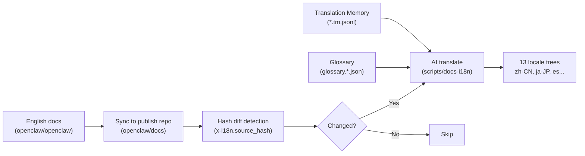

# openclaw-market 内容创作经验借鉴

> 从一个开源 AI 助手仓库中提取的 7 大内容创作方法论

---

## 总览

`openclaw-market` 并非传统意义上的"内容创作工具"，但它的 **文档体系本身就是一部教科书级的内容产品**。从 README 到 Showcase，从 CHANGELOG 到 i18n 管线，每一层都有值得深度借鉴的设计模式。

| 维度 | 核心启示 | 对应文件/机制 |
|---|---|---|
| 文档架构 | 分层信息架构 + 语义前置 | `docs/docs.json`, YAML frontmatter |
| 叙事语调 | 反 AI 腔，有态度的技术写作 | `SOUL.md`, `VISION.md` |
| 社区内容 | 用户生成内容 (UGC) 策展 | `showcase.md` |
| 变更日志 | CHANGELOG 作为内容产品 | `CHANGELOG.md` |
| 自动化翻译 | AI 驱动的 13 语种 i18n 管线 | `docs/.i18n/` |
| 人格系统 | Persona-as-Code | `SOUL.md` + "Molty Prompt" |
| 贡献者经营 | 透明、结构化的贡献体系 | `CONTRIBUTING.md` |

---

## 1. 📐 文档架构：分层 + 语义前置 (Semantic Frontmatter)

### 核心模式

```yaml
# 每个文档的 YAML frontmatter
---
summary: "Define permanent operating authority for autonomous agent programs"
read_when:
  - Setting up autonomous agent workflows that run without per-task prompting
  - Defining what the agent can do independently vs. what needs human approval
title: "Standing Orders"
---
```

### 借鉴要点

| 机制 | 作用 | 你可以怎么用 |
|---|---|---|
| `summary` 字段 | 一句话让 AI 和人类都能判断文档价值 | 所有内容加元数据摘要，便于 RAG 检索 |
| `read_when` 数组 | **意图驱动路由**：明确告诉读者（或AI代理）什么场景需要读这个文档 | 内容管理系统中实现"按需呈现" |
| 分层导航 (`docs.json`) | 44KB 的导航配置 = 信息建筑蓝图 | 内容站点用结构化导航而非平铺 |
| Mintlify Card/Steps 组件 | 视觉层次清晰，扫描友好 | 用组件化思维写文档，而非纯文本 |

> [!TIP]
> **关键洞察**：`read_when` 是一个天才设计——它把"这篇文章什么时候有用"变成了机器可读的路由规则。这种"意图标签"思维可以直接应用到任何内容库。

---

## 2. ✍️ 叙事语调：反 AI 腔，有态度的技术写作

### SOUL.md 的启示

这是项目给 AI 代理调音的方法论，但对**人类内容创作**同样有教科书级价值：

```markdown
## 好的规则像这样：
- have a take
- skip filler  
- be funny when it fits
- call out bad ideas early
- stay concise unless depth is actually useful

## 坏的规则像这样：
- maintain professionalism at all times
- provide comprehensive and thoughtful assistance
- ensure a positive and supportive experience

那第二组规则就是你得到糊状物的原因。
```

### VISION.md 的叙事技法

```markdown
"OpenClaw is the AI that actually does things."
```

一句话定义。不是"OpenClaw 是一个基于多模型架构的智能助手平台"——而是 **"能干活的AI"**。

### 借鉴要点

| 技法 | 示例 | 应用场景 |
|---|---|---|
| **一句话定义** | "The AI that actually does things" | 产品定位、文章 lead |
| **反面示例教学** | "Bad rules sound like this…" | 风格指南、团队培训 |
| **The Molty Prompt** | 让 AI 重写自己的人格文件 | 内容语调迭代 |
| **Sharp beats vague** | 短胜过长，尖锐胜过模糊 | 所有文案的核心原则 |
| **吉祥物语气** | "EXFOLIATE! EXFOLIATE!" (空间龙虾) | 品牌记忆点 |

> [!IMPORTANT]
> **"Molty Prompt" 方法论**：让 AI 先读现有内容，然后按照一组风格规则重写。这不是一次性的 prompt，而是一个**可迭代的内容调音管线**。这个思路可以直接搬到内容自动化中。

---

## 3. 🎨 Showcase 策展：UGC 作为内容引擎

### showcase.md 的结构设计

474 行的社区案例展示页，结构极其清晰：

```
📦 Showcase
├── Hero 区（一句话总结 + 3 个亮点标签）
├── 跳转链接（Videos / Fresh / Automation / Memory / Voice...）
├── 视频区（3 个 YouTube embed，从入门到深入）
├── 分类卡片组
│   ├── Fresh from Discord（最新社区项目）
│   ├── Automation & Workflows
│   ├── Knowledge & Memory
│   ├── Voice & Phone
│   ├── Infrastructure & Deployment
│   ├── Home & Hardware
│   └── Community Projects
└── Submit Your Project（CTA）
```

### 每张卡片的信息密度

```html
<Card title="Tesco Shop Autopilot" icon="cart-shopping" href="...">
  **@marchattonhere** • `automation` `browser` `shopping`
  
  Weekly meal plan → regulars → book delivery slot → confirm order.
  No APIs, just browser control.
  
  
</Card>
```

**一张卡片包含**：标题 + 作者 + 标签 + 一句话价值主张 + 截图。完美的内容原子。

### 借鉴要点

| 模式 | 作用 | 你可以怎么用 |
|---|---|---|
| **分类策展** | 信息不堆砌，按用途分区 | 案例库/作品集设计 |
| **标签系统** | `automation` `browser` `shopping` | 内容可发现性 |
| **一句话 value prop** | "No APIs, just browser control" | 所有案例的核心表达 |
| **CTA 闭环** | 页底 3 步 Submit 流程 | 鼓励用户贡献内容 |
| **视频+卡片混合** | 不同学习风格的读者都被覆盖 | 多媒体内容策略 |

---

## 4. 📋 CHANGELOG 作为内容产品

### 设计模式

6504 行，120 万字节的 CHANGELOG。每条 entry 都是一篇微型技术文章：

```markdown
- BlueBubbles/groups: forward per-group `systemPrompt` config into inbound 
  context `GroupSystemPrompt` so configured group-specific behavioral 
  instructions (for example threaded-reply and tapback conventions) are 
  injected on every turn. Supports `"*"` wildcard fallback matching the 
  existing `requireMention` pattern. Closes #60665. (#69198) 
  Thanks @omarshahine.
```

**每条包含**：
1. **组件前缀** (`BlueBubbles/groups`)
2. **行为描述**（做了什么）
3. **动机解释**（为什么）
4. **Issue 关联** (`Closes #60665`)
5. **PR 编号** (`#69198`)
6. **贡献者致谢** (`Thanks @omarshahine`)

### 借鉴要点

| 技法 | 作用 |
|---|---|
| **组件前缀命名** | 读者可按兴趣跳读 |
| **行为+动机** 双写 | 不只说"做了什么"，还说"为什么要做" |
| **致谢链接** | 把 CHANGELOG 变成社区荣誉墙 |
| **Changes/Fixes 分区** | 用户关心新功能 vs 修复，分开写 |

> [!TIP]
> CHANGELOG 本身就是一个**内容自动化的绝佳候选场景**：PR merge → 自动提取 commit message → 按组件分类 → 格式化 → 生成周报/月报。

---

## 5. 🌍 AI 驱动的 i18n 管线：13 语种自动翻译

### 架构



### 核心机制

| 组件 | 作用 | 借鉴价值 |
|---|---|---|
| **Source hash 比对** | 只翻译变更过的文件 | 增量处理 = 节省 token/成本 |
| **术语表 (Glossary)** | `glossary.zh-CN.json` 有 6.7KB 术语映射 | 保证专有名词一致性 |
| **翻译记忆 (TM)** | `*.tm.jsonl` 按 hash 缓存翻译结果 | 避免重复翻译相同内容 |
| **Release 触发** | GitHub release 后自动 dispatch 翻译 | 发布驱动的内容更新 |
| **每日 Cron** | 兜底的定时翻译 | 确保不会漏掉任何变更 |

> [!IMPORTANT]
> **这是一个生产级的 AI 内容管线**，不是 demo。它处理 13 种语言、增量更新、术语一致性、翻译缓存——这套架构可以直接搬到任何需要多语言内容的项目。

---

## 6. 🧠 Persona-as-Code：可版本化的品牌声音

### 核心思想

OpenClaw 把品牌人格变成了一个 **可 git 跟踪、可 AI 迭代、可 A/B 测试的文件**：

```
~/.openclaw/workspace/
├── SOUL.md          ← 语调/人格/幽默/边界
├── AGENTS.md        ← 操作规则/权限/升级
├── IDENTITY.md      ← 身份定义
├── MEMORY.md        ← 记忆上下文
├── HEARTBEAT.md     ← 定期执行的任务
└── BOOTSTRAP.md     ← 启动时注入的上下文
```

### 关键洞察

```
Personality (SOUL.md)  ≠  Operations (AGENTS.md)
语调/态度/风格         ≠  权限/流程/审批
```

**分离关注点**：品牌声音和操作规则是两个独立维度。混在一起会导致"专业语气"压制了"有趣的声音"。

### 借鉴要点

| 模式 | 应用 |
|---|---|
| **SOUL.md 分离** | 内容风格指南独立于操作 SOP |
| **The Molty Prompt** | AI 自审 + 按规则重写 = 迭代调音 |
| **反面示例** | 明确写出"不要像这样" |
| **版本化** | 品牌声音变更可追踪、可回滚 |

---

## 7. 🤝 贡献者经营：把贡献流程变成内容

### CONTRIBUTING.md 的信息设计

230 行的贡献指南本身就是内容运营的范本：

| 区块 | 设计意图 |
|---|---|
| **维护者名录** (含 GitHub + X 链接) | 人格化、可触达 |
| **PR 限额** (10/人硬上限) | 设置预期，避免低质量泛滥 |
| **AI PR 欢迎政策** | "AI PRs are first-class citizens" — 明确拥抱 AI 辅助 |
| **当前聚焦 + 路线图** | 告诉贡献者"现在做什么最有价值" |
| **安全报告模板** | 8 项必填 = 结构化信息收集 |

### 关键句型

```markdown
"We review every human-only-written application carefully and add 
maintainers slowly and deliberately."
```

这句话同时完成了三件事：
1. 设置预期（会慢）
2. 传达标准（仔细审核）
3. 排除 AI 生成的申请

---

## 综合行动方案

> [!IMPORTANT]
> 以下按**投入产出比**排序，从最容易落地到最需要投入：

### 🟢 立即可用

| # | 行动 | 来源模式 | 预计耗时 |
|---|---|---|---|
| 1 | 所有文档加 `summary` + `read_when` frontmatter | 语义前置 | 每篇 2 分钟 |
| 2 | 创建 `SOUL.md` 风格指南 + "Molty Prompt" 调音 | Persona-as-Code | 1 小时 |
| 3 | CHANGELOG 条目加组件前缀 + 动机描述 + 致谢 | CHANGELOG 产品化 | 每条 1 分钟 |

### 🟡 短期实施

| # | 行动 | 来源模式 | 预计耗时 |
|---|---|---|---|
| 4 | 建立 Showcase 策展页（分类+标签+截图+CTA） | UGC 策展 | 1-2 天 |
| 5 | 设计贡献指南 + 维护者名录 | 贡献者经营 | 半天 |
| 6 | CHANGELOG → 周报自动化（Standing Orders + Cron） | 自动化管线 | 1 天 |

### 🔴 长期投资

| # | 行动 | 来源模式 | 预计耗时 |
|---|---|---|---|
| 7 | 搭建 AI i18n 管线（增量翻译+术语表+TM） | 多语种管线 | 1-2 周 |
| 8 | 全站内容自动化（研究→写作→编辑→发布） | OpenProse + Standing Orders | 2-4 周 |

---

## 参考文件索引

| 文件 | 借鉴维度 |
|---|---|
| [VISION.md](file:///Users/youjia/dev/openclaw-market/VISION.md) | 叙事定位 |
| [CONTRIBUTING.md](file:///Users/youjia/dev/openclaw-market/CONTRIBUTING.md) | 社区运营 |
| [CHANGELOG.md](file:///Users/youjia/dev/openclaw-market/CHANGELOG.md) | 变更日志产品化 |
| [docs/concepts/soul.md](file:///Users/youjia/dev/openclaw-market/docs/concepts/soul.md) | 品牌声音工程 |
| [docs/start/showcase.md](file:///Users/youjia/dev/openclaw-market/docs/start/showcase.md) | UGC 策展设计 |
| [docs/automation/standing-orders.md](file:///Users/youjia/dev/openclaw-market/docs/automation/standing-orders.md) | 自主执行权限框架 |
| [docs/.i18n/README.md](file:///Users/youjia/dev/openclaw-market/docs/.i18n/README.md) | AI 翻译管线架构 |
| [docs/AGENTS.md](file:///Users/youjia/dev/openclaw-market/docs/AGENTS.md) | 文档治理规则 |
| [docs/index.md](file:///Users/youjia/dev/openclaw-market/docs/index.md) | 信息架构 + 组件化写作 |
